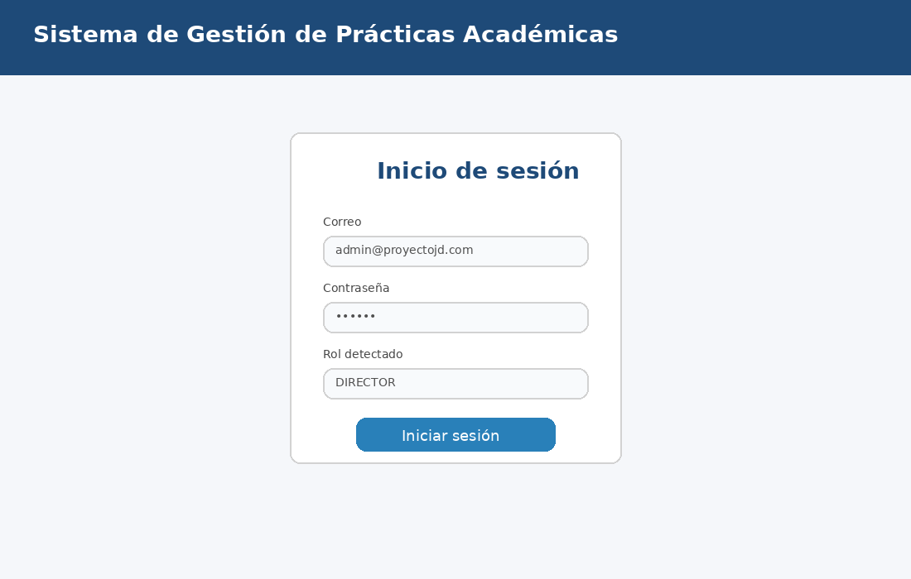
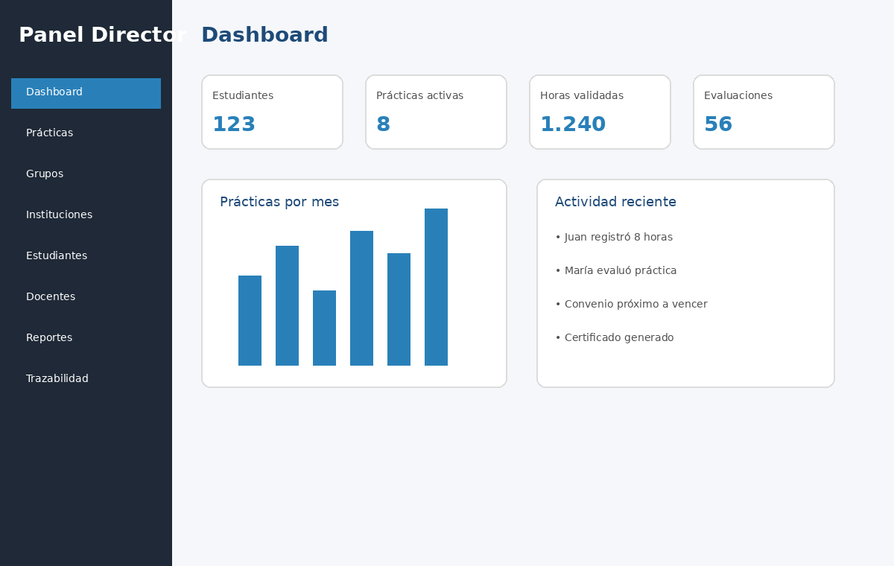
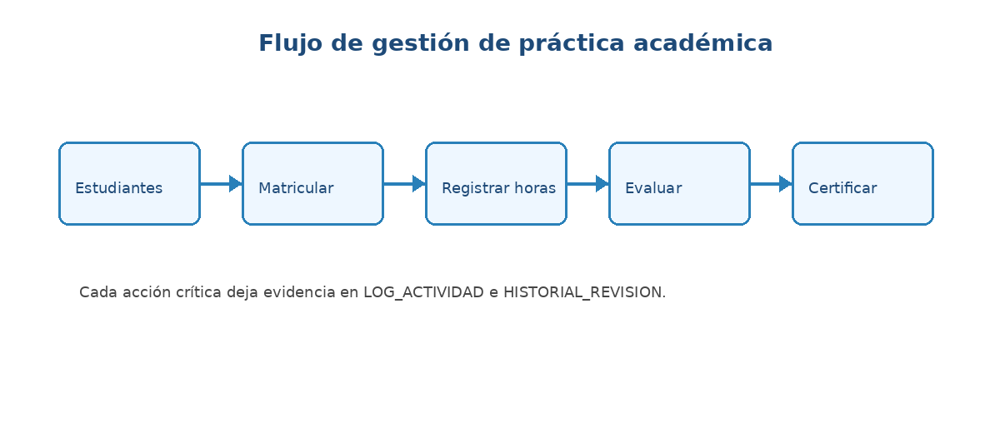

# Manual de usuario
## Sistema de Gestión de Prácticas Académicas v1.0

Este manual explica el flujo completo del sistema desde el ingreso hasta la generación de reportes y certificados. La interfaz fue diseñada para que el usuario siga el proceso natural: **Estudiantes > Matricular a práctica > Registrar horas > Evaluar > Generar certificado**.

## 1. Iniciar sesión

1. Abra el sistema desde NetBeans o ejecutando `dist/GestionPracticas.jar`.
2. Digite el correo y contraseña asignados.
3. El sistema valida el rol en la tabla `USUARIO` y abre el panel correspondiente.
4. Si el usuario está inactivo, el sistema bloquea el ingreso.

Usuarios de prueba:

| Rol | Correo | Contraseña |
|---|---|---|
| Director | admin@proyectojd.com | 123456 |
| Coordinador | carlos@proyectojd.com | 123456 |
| Docente | maria@proyectojd.com | 123456 |
| Estudiante | juan@proyectojd.com | 123456 |
| Institución | empresa@proyectojd.com | 123456 |

## 2. Panel del Director

El Director puede ver indicadores, gestionar usuarios, prácticas, programas, cursos, reportes y revisar trazabilidad.

Acciones principales:

1. Crear o editar usuarios con rol.
2. Crear programas y cursos.
3. Crear prácticas con horas reglamentarias.
4. Consultar reportes generales.
5. Revisar actividad reciente y trazabilidad.

## 3. Matricular estudiante en práctica

Responsable: Coordinador o Director.

1. Ingrese al módulo de estudiantes o matrículas.
2. Seleccione el estudiante con rol `ESTUDIANTE`.
3. Seleccione práctica, grupo e institución receptora.
4. Guarde la matrícula.
5. El sistema registra la operación en `LOG_ACTIVIDAD` y deja el estudiante en etapa `ELECTIVA`.

## 4. Registrar horas y actividades

Responsable: Estudiante.

1. Ingrese como estudiante.
2. Abra el módulo de actividades.
3. Registre fecha, descripción, tipo de actividad y número de horas.
4. Adjunte evidencia en PDF, DOCX, JPG o PNG si aplica.
5. Guarde el registro.

Responsable: Institución receptora.

1. Ingrese como institución.
2. Consulte estudiantes asignados.
3. Confirme horas ejecutadas.
4. El sistema actualiza `HORAS_PRACTICA` y deja evidencia en auditoría.

## 5. Evaluar estudiante

Responsable: Docente asesor.

1. Abra el panel del docente.
2. Seleccione rúbrica y estudiante.
3. Califique criterios y registre observación general.
4. Retroalimente respuestas del estudiante.
5. Guarde la evaluación.

La evaluación se almacena en `EVALUACION`, los criterios en `CRITERIO_RUBRICA` y los niveles en `NIVEL_DESEMPENO`.

## 6. Cambiar de etapa electiva a productiva

Responsable: Coordinador o Director.

El cambio se permite cuando el estudiante cumple:

1. Horas mínimas aprobadas.
2. Evaluación registrada y aprobada.
3. Documentos/evidencias aprobadas.

Al aprobarse, el sistema actualiza `MATRICULA_PRACTICA.ETAPA_ACADEMICA` a `PRODUCTIVA` y registra el cambio en `HISTORIAL_REVISION`.

## 7. Generar reportes PDF

Desde el módulo de reportes puede generar:

- Reporte de avance de horas.
- Reporte de evaluación final.
- Certificado de práctica.

Cada PDF incluye un código verificable compuesto por tipo de reporte, ID, fecha de emisión y hash SHA-256 simulado. Esto permite trazabilidad del documento.

## 8. Panel de trazabilidad

Consulte `LOG_ACTIVIDAD` para saber:

- Quién realizó la acción.
- Fecha y hora.
- Tabla afectada.
- Tipo de operación.
- Valor anterior y valor nuevo.

Consulte `HISTORIAL_REVISION` para revisar cambios de etapa, observaciones y responsables.

## 9. Ayuda contextual

Cada formulario principal cuenta con botón de ayuda o mensajes de validación. Cuando un campo obligatorio está vacío, el sistema muestra una alerta antes de guardar.
